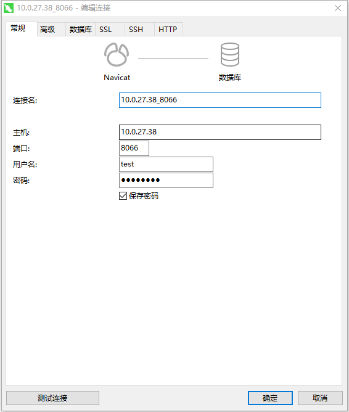

# 数据库插件

## 版本

mysql 8.0.33

## 部署过程：

1. 将镜像文件导入到服务器（linux系统） ,比如镜像包名为mysql8033.tar
2. 镜像文件所在目录执行下列命令，加载镜像 `docker load -i mysql8033.tar`

3. 创建目录

~~~
创建数据目录 /home/data/mysql
创建配置文件 /home/config/mysql/my.cnf
配置文件my.cnf内容根据自身需求书写
~~~

4. 启动服务，命令如下：

~~~
docker run --name svc-mysql -p 3306:3306 -e MYSQL_ROOT_USERNAME=root -e MYSQL_ROOT_PASSWORD=123456 -v /home/data/mysql:/var/lib/mysql -v /home/config/mysql/my.cnf:/etc/mysql/my.cnf --network=jky_network -d mysql:8.0.33
~~~

参数说明：

~~~
--name svc-mysql：指定容器名称为svc-mysql，为自定义
--network=jky_network：为容器指定网络为jky_network，同一网络下的容器能够通过容器名称互通。
~~~

## 使用文档

通过上面部署命令启动完毕的mysql，来进行mysql相关业务能力调用。

1. 连接mysql服务器
   当MySQL服务器启动后，你需要连接到它才能执行任何操作。你可以使用MySQL提供的客户端工具来连接MySQL服务器。在Windows中，你可以使用MySQL
   Workbench或者命令行客户端；在Linux中，你可以使用命令行客户端。
   `mysql -h host -u user -p`

在windows中，可以直接通过诸如navicat相关工具直接连接

2. 创建数据库`mysql> CREATE DATABASE dbname;`
3. 更新数据`mysql> UPDATE tablename SET column1 = value1, column2 = value2 WHERE condition;
   `
4. 常见代码集成demo

### java：

~~~
   spring:
  application:
    name: nnnn
  datasource:
    driver-class-name: com.mysql.jdbc.Driver
    username: root
    url: jdbc:mysql://svc-mysql:3306/tdb?characterEncoding=utf-8&characterSetResults=utf8&autoReconnect=true&useSSL=false&allowMultiQueries=true
    password: iii

~~~

### python：

~~~
import pymysql
DBHOST = ""
DBPORT =
DBUSER = ""
DBPWD = ""
DBNAME = ""
DBCHAR = "utf8mb4"

class Mysql(object):
"""
MYSQL数据库对象，负责产生数据库连接 , 此类中的连接采用连接池实现获取连接对象：conn = Mysql.getConn()
释放连接对象;conn.close()或del conn
"""
#连接池对象
__pool = None

    def __init__(self):
        # 数据库构造函数，从连接池中取出连接，并生成操作游标
        self._conn = Mysql.__getConn()
        self._cursor = self._conn.cursor()

    @staticmethod
    def __getConn():
        """
        @summary: 静态方法，从连接池中取出连接
        @return MySQLdb.connection
        """
        if Mysql.__pool is None:
            __pool = PooledDB(
                creator=mysql_config.DB_CREATOR,
                mincached=mysql_config.DB_MIN_CACHED,
                maxcached=mysql_config.DB_MAX_CACHED,
                maxshared=mysql_config.DB_MAX_SHARED,
                maxconnections=mysql_config.DB_MAX_CONNECYIONS,
                blocking=mysql_config.DB_BLOCKING,
                maxusage=mysql_config.DB_MAX_USAGE,
                setsession=mysql_config.DB_SET_SESSION,

                host=mysql_config.DBHOST,
                port=mysql_config.DBPORT,
                user=mysql_config.DBUSER,
                passwd=mysql_config.DBPWD,
                db=mysql_config.DBNAME,
                use_unicode=False,
                charset=mysql_config.DBCHAR,
                cursorclass=DictCursor)
        return __pool.connection()

~~~

