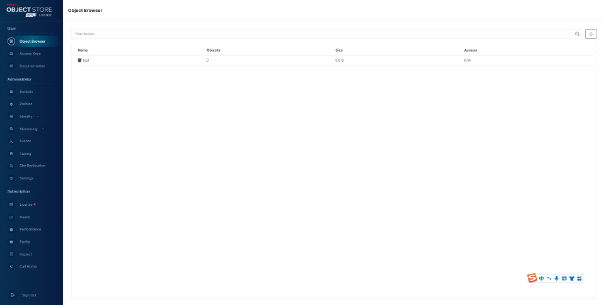

# 文件存储插件

## 版本

2023.05.04

## 部署过程

1. 将镜像文件导入到服务器（linux系统） 比如镜像包名为`minio.tar`
2. 镜像文件所在目录执行下列命令，加载镜像
   `docker load -i minio.tar`

3. 创建目录

```commandline
建数据目录 /home/data/minio
创建配置文件 /home/config/minio
配置文件根据自身需求书写
```

4. 启动服务，命令参考如下：

```commandline
docker run -d -p 19100:9000 -p 19101:9001 --name sz-minio \
-e "MINIO_ROOT_USER=admin" \
-e "MINIO_ROOT_PASSWORD=123456" \
-e "MINIO_SERVER_URL=http://sz-minio:9000  " \
-v /home/data/minio:/data \
-v /home/config/minio:/root/.minio \
--network=jky_network \
minio/minio server  /data --console-address ":9001" -address ":9000"
```

参数说明：

```commandline
--name svc-minio：指定容器名称为svc-minio，为自定义
--network=jky_network：为容器指定网络为jky_network，同一网络下的容器能够通过容器名称互通。
9000为客户端连接端口    9001为web管理端口

```

启动成功后，可通过 {ip}:19101 访问minio


## 使用文档

上述平台部署完毕后，可以在平台界面进行数据的上传管理等操作，以下介绍程序端对接流程：

### java案例:

引入pom文件依赖

```commandline
<dependency>
     <groupId>io.minio</groupId>
     <artifactId>minio</artifactId>
     <version>RELEASE.2020-07-02T01-25-59Z</version>
</dependency>

```

.创建MinIO客户端对象：使用以下代码创建一个MinIO客户端对象：

```commandline
import io.minio.MinioClient;

public class MinioExample {
  public static void main(String[] args) throws Exception {
    // 使用MinIO服务器的URL、Access Key和Secret Key来创建一个MinIO客户端对象
    MinioClient minioClient = new MinioClient("http://localhost:9000", "YOUR-ACCESSKEYID", "YOUR-SECRETACCESSKEY");

    // 检查MinIO服务器是否可以连接
    boolean found = minioClient.bucketExists("mybucket");
    if (found) {
      System.out.println("mybucket exists");
    } else {
      System.out.println("mybucket does not exist");
    }
  }
}


```

执行操作：一旦你有了MinIO客户端对象，你就可以执行各种操作，如创建桶、上传文件、下载文件等。以下是一些示例：

```commandline
// 创建一个新的桶
minioClient.makeBucket("mybucket");

// 上传文件
minioClient.putObject("mybucket", "myobject", "/path/to/myfile");

// 下载文件
minioClient.getObject("mybucket", "myobject", "/path/to/downloaded/file");


```

### python案例

安装对应的包`pip install minio`

创建minio对象

```commandline
from minio import Minio
from minio.error import ResponseError
# 初始化Minio对象
client = Minio('play.min.io',
               access_key='ACCESS_KEY',
               secret_key='SECRET_KEY',
               secure=True)


```

列出存储桶

```commandline
buckets = client.list_buckets()
for bucket in buckets:
    print(bucket.name, bucket.creation_date)


```

这段代码将打印所有存储桶的名称和创建日期。

创建存储桶

```commandline
try:
    client.make_bucket("mybucket")
except ResponseError as err:
    print(err)


```

上传文件

```commandline
try:
    client.fput_object('mybucket', 'myfile.txt', '/path/to/local/file')
except ResponseError as err:
    print(err)


```

获取下载文件

```commandline
try:
    client.fget_object('mybucket', 'myfile.txt', '/path/to/local/file')
except ResponseError as err:
    print(err)


```

这段代码将从名为“mybucket”的存储桶中获取名为“myfile.txt”的对象，并将其下载到本地文件/path/to/local/file中。
