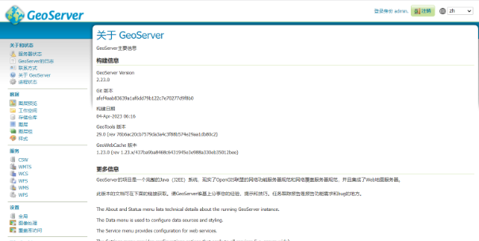

# 时空引擎插件

## 版本：

2.23.0

## 部署过程：

1. 将镜像文件导入到服务器（linux系统） 比如镜像包名为`geoserver.tar`
2. 镜像文件所在目录执行下列命令，加载镜像
   `docker load -i geoserver.tar`
3. 创建数据卷 在本地创建一个数据卷，用于保存 GeoServer 数据和配置。使用以下命令创建数据卷：
   `docker volume create geoserver_data`

4. 运行容器 使用以下命令运行容器，并将本地的 8080 端口映射到容器内的 8080 端口：

```
docker run -d --name geoserver -p 8080:8080 -v geoserver_data:/opt/geoserver/data_dir kartoza/geoserver
```

5. 访问 GeoServer，现在可以通过浏览器访问 GeoServer。在浏览器中输入 `ttp://localhost:8080/geoserver` 即可进入 GeoServer 的管理界面。
6. 查看默认的密码。通过如下命令查看日志，查看启动时候生成的默认密码： `docker log containId`
   

## 使用文档

### python案例：

定义 Geoserver 的 URL 和数据

```commandline
geoserver_url = 'http://localhost:8080/geoserver/rest'
workspace = 'my_workspace'
store = 'my_datastore'
layer = 'my_layer'


```

使用 requests 模块发送请求来获取 Geoserver 中的图层信息：

```commandline
url = f"{geoserver_url}/workspaces/{workspace}/datastores/{store}/featuretypes/{layer}.json"

headers = {
    'Content-Type': 'application/json',
    'Accept': 'application/json'
}

response = requests.get(url, headers=headers)


```

在上面的代码中，我们向 Geoserver 发送了一个 GET 请求，并在请求头中指定了 Content-Type 和 Accept。我们还将 workspace、store 和 layer 替换为实际值。

```commandline
if response.status_code == 200:
    data = json.loads(response.content.decode('utf-8'))
    
    print(f"Layer Name: {data['featureType']['name']}")
    print(f"Number of Attributes: {len(data['featureType']['attributes']['attribute'])}")
else:
    print("Error occurred while retrieving layer information")


```

在上面的代码中，我们首先检查响应的状态码是否为 200（表示请求成功），然后将响应内容 解析为 JSON 格式，并从响应中提取我们需要的信息。如果出现错误，则输出错误消息

### JavaScript案例

要从JS中调用GeoServer，可以使用以下步骤：

首先，确保您在GeoServer上发布了WMS服务。这将允许您通过URL获取地图图层。

接下来，在JavaScript代码中，使用XMLHttpRequest对象或fetch()函数发出与GeoServer的HTTP请求，并指定所需图层的URL。

例如，如果您想获取名为“myLayer”的图层，请使用以下代码：

```commandline
var layerUrl = "http://localhost:8080/geoserver/wms?service=WMS&version=1.1.0&request=GetMap&layers=myLayer&styles=&bbox=-180,-90,180,90&width=1000&height=500&srs=EPSG:4326&format=image/png";

```

发送HTTP请求后，您可以将响应解析为图像并将其添加到网页上的地图容器。

```commandline
var mapContainer = document.getElementById("map");
var image = new Image();
image.src = layerUrl;
mapContainer.appendChild(image);


```

请注意，您需要将“myLayer”替换为实际的图层名称，并根据需要更改其他参数，例如“bbox”（边界框）和“srs”（空间参考系）。另外，请确保您已经在HTML文件中创建了一个具有“map”ID的元素，以便图像可以添加到其中。

